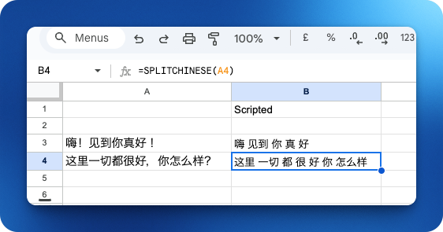

# Split Chinese

Split Chinese into words.

This API is a tiny wrapper around [MandarinSpot](https://mandarinspot.com/annotate).

Please do not abuse this API or MandarinSpot.


Please also note that there is an official JS library you can use client side [https://mandarinspot.com/api](https://mandarinspot.com/api).


```shell
yarn install
yarn dev
```

Example usage:
```javascript
let response = await fetch("http://localhost:3000/?text=你好吗");

let data = await response.json();
console.log(data);
```


## Usage

The idea was to run this server, say with ngrok, and then add a custom google sheets function to run it.

```javascript
function splitChinese(text) {
  if (!text || text === '') {
    return '';
  }

  const encodedText = encodeURIComponent(text);
  const response = UrlFetchApp.fetch('https://7973-78-70-155-234.ngrok-free.app/?text=' + encodedText);
  const jsonText = response.getContentText()
  const data = JSON.parse(jsonText);
  return data.segmented;
}

```

This can then be used in google sheets like this:


